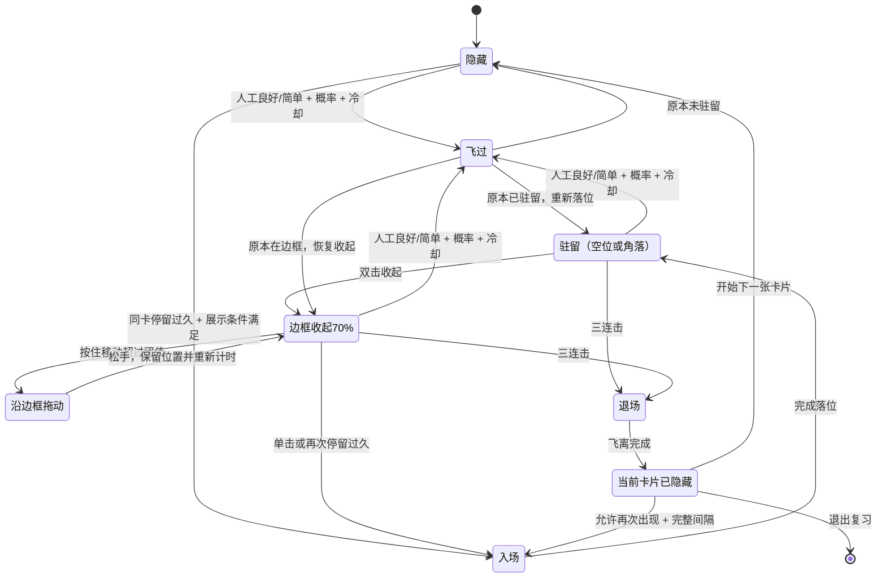

# 复习桌宠：行为规则建议

评估日期：2026-10-08。适用于[应用注入桌宠方案](pet-reviewer-feasibility.md)中的新学习屏。本次仅提出行为与接入方案，尚未实施。

用户提出的规则是：按“良好／简单”后才有机会飞过；满足条件时入场并驻留；没有空位就在右下角；按三下退场。用户已确认飞过采用“保留概率，并加冷却”。

用户补充：入场的目的是在一张卡片停留过久时抓回注意力，同时需要照顾长时间记忆同一卡片的情况，退场后是否再次出现可以进入设置。

用户新增：初始隐藏；驻留后双击使桌宠 70% 沉入左/右边框，单击露出部分按正常曲线飞出并停留，或再次停留过久后自动展开；收起时可以按住并随手指沿边框移动。

以下将“按三下”理解为连续点击桌宠三下，保留单击换位并新增双击收起和边框拖动。推荐使用同一卡片的停留时长，三连击退场后的同卡再次出现做成开关。数值、开关默认值及退场作用范围均为建议起始方案，便于后续调整。

## 建议的默认规则

| 行为 | 触发与结果 | 建议起始值 |
| --- | --- | --- |
| 初始状态 | 新进入复习时隐藏，满足评分飞过或停留提醒条件后显示 | 不在页面初始化时直接驻留 |
| 飞过 | 人工“良好／简单”评分成功，满足冷却后抽一次概率；“重来／困难”和单纯显示背面不触发 | 两种评分均为 10%；成功开始飞过后冷却 30 秒 |
| 飞过时长 | 使用同一只桌宠完成一次动作，不阻塞评分或换卡 | 约 2 秒 |
| 停留提醒入场 | 同一卡片前台停留达到阈值，满足下面的显示条件 | 建议先从 60 秒开始；移动沿用约 2 秒渐停曲线 |
| 正常驻留 | 优先寻找能容纳正常尺寸桌宠的空位 | 保留素材和位置，换卡后重新验证 |
| 右下角停靠 | 没有正常尺寸空位时，缩小并贴在卡片可见区域右下角 | 缩至正常尺寸的 60%，离边缘约 8 CSS px |
| 单击换位 | 连击识别超时后，重新寻找空位；没有其他空位时保留角落位置 | 最后一下后等待 400ms 才移动 |
| 双击边框收起 | 已驻留时双击，选择附近左/右边框，收起宽度的 70% | 保留 30% 可见和可交互，保持纵向位置 |
| 边框单击展开 | 点击露出部分，飞出并找空位停留，无空位则右下角停靠 | 使用正常换位的时长与渐停曲线 |
| 边框自动展开 | 收起后再次停留过久，且当前适合显示 | 收起完成或拖动松手后重新等待停留提醒时长 |
| 边框拖动 | 按住露出部分，沿所在边框上下跟随手指 | 始终收起 70%；松手保留位置并重新等待自动展开 |
| 三连击退场 | 相邻两下间隔不超过 400ms，第三下立即取消待执行动作并退场 | 退场约 0.6 秒；默认当前卡片不再出现，下一张重新允许 |
| 退场后再次出现 | 设置开关决定当前卡片继续停留时是否再入场 | 默认关闭；开启后距上次手动退场至少 2 分钟 |

原有 15 秒从每面初始化或无操作计时，不适合直接表达“同一卡片停留过久”。60 秒是待体验调整的初始建议，可以在设置中改为 30、60、120 秒或关闭停留提醒；先不增加连续答对、学习数量等其他条件。

## 1. 评分后飞过

### 以评分成功为准

监测统一的评分成功事件，而不只监听两个按钮的点击。按钮、键盘快捷键和评分手势应得到相同结果；操作失败、不合法的评分请求或重复的事件转发不会触发动画。

默认只接受人工评分。自动复习也可能提交“良好”，需要携带来源，避免自动评分被当作用户按下按钮。撤销和重做不重播；撤销后用户再次人工评分属于新的评分操作，可以重新按冷却和概率判断。

### 冷却和概率

1. 检查功能已启用、应用在前台、被评分的本次卡片停留未被手动隐藏。
2. 仅处理人工 `GOOD` / `EASY`；同一次成功评分只处理一次。
3. 检查距上次实际开始飞过至少 30 秒；飞过、入场、退场、收起/展开动画、连击识别和拖动期间不追加动作。
4. 满足条件后抽一次 10% 概率。两种评分先采用相同概率。
5. 抽中后等待下一张卡片的渲染完成通知，确认当前页面可展示，再开始动画；冷却从实际开始时计算。

概率未命中不消耗冷却。冷却期间的评分直接跳过，之后不补播。最多保留一个短暂等待渲染的请求；建议等待上限约 1.5 秒，渲染失效、退出复习或进入后台就丢弃。最后一题答完后正常结束复习，不为动画延长界面停留。

### 已有桌宠时怎么处理

- 原来隐藏：从屏幕边缘飞过，结束后回到隐藏状态；不会自动变成驻留。
- 原来驻留：使用当前那只起飞，结束后按新卡片的几何信息重新落位；保留原驻留素材，必要时进入右下角停靠。
- 原来边框收起：使用当前那只飞过，完成后恢复边框模式；不因评分动作永久展开，下一张卡片的停留计时照常重新开始。
- 正在入场、换位或飞过：跳过新的飞过请求，不创建第二只，不积压动画队列。

飞过阶段建议不接收点击，触摸穿过到卡片；单击、双击和三连击用于驻留/边框状态。飞过路径允许短暂经过内容，落位再执行避让；若以后要求飞行全程避开内容，需要另加路径规则。

## 2. 同一卡片的停留提醒与驻留

建议首期只用“同一卡片停留过久”作为提醒依据，同时满足：

- 当前处于前台的新学习屏，卡片与可见区域已准备好，停留提醒没有关闭。
- 本次卡片停留累计达到设定阈值，且当前没有驻留或飞过的桌宠。
- 当前卡片没有被三连击隐藏，或已开启再次出现并完成重复提醒间隔。
- 未输入答案，软键盘、白板、菜单或弹窗没有占用交互；没有录音、媒体播放或自动复习正在推进卡片。
- 最近约 3 秒没有正在进行的触摸/滚动，布局已经稳定，避免在用户操作中插入动画。

### 停留时间怎么计算

从新卡片正面准备好开始累计。正反面属于同一次卡片停留，翻面不清零；普通点击、滚动和快捷键只推迟到一个短暂的安静窗口，不清零总停留时间。持续滚动结束后再提醒。

后台、弹窗、白板、媒体播放、录音和输入等占用时间不计入停留。恢复后先重新测量，至少经过短暂安静窗口才允许入场，不补播后台提醒。这样可以保留过久停留的含义，也不会把听音频或离开应用的时间误当作走神。

换到下一张卡片后重新计时。用应用生成的卡片停留实例标识 `visitId` 区分一次访问：同一卡片重新抽到、撤销后重新进入属于新访问；只翻面、重新排版或 WebView 重建仍属于原访问。停留累计和手动隐藏状态在复习 ViewModel 中保留，不能因 DOM 重建归零。

### 长时间记忆同一卡片

应用不能准确判断用户是在走神还是认真记忆，因此避免仅凭停留时间反复强制出现。默认允许提醒一次；用户三连击退场后，该次卡片停留不再提醒。开启“退场后再次出现”后，才允许在同一卡片上再次入场。

一旦驻留，不因普通操作、评分或换卡自动退场。位置仍有效则保留，位置失效则重新落位；双击进入边框收起，三连击或退出复习结束这次驻留。播放视频、输入等模式可暂时隐藏，模式结束后恢复原有驻留/边框模式，重新测量后显示。

## 3. 没有空位时停在右下角

右下角指**卡片 WebView 的实际可见区域**，不包含底部评分按钮或屏幕系统栏。位置根据可见区域、软键盘和页面缩放重新计算。

推荐顺序：先找正常尺寸空位，找不到则进入缩小的角落停靠。空位检测函数仍返回 `null`；管理器单独记录“角落停靠”状态，不把这个位置标成已通过内容避让。

需要明确一个取舍：没有空位时，右下角也可能有文字或图片，因此角落停靠会允许小范围内容覆盖。缩小和贴边能减轻遮挡，无法保证完全不遮挡。

同时保留这些约束：

- 输入框、播放按钮、链接等交互控件及原生覆盖区是必须避开的区域；检测模块单独报告这些矩形。
- 角落位置与控件冲突、可见区域连缩小桌宠也容纳不了，或几何不可用时暂时隐藏；不强行覆盖控件。
- 角落状态保持位置，不随每次滚动随机跳动。渲染完成或滚动停止后若有正常尺寸空位，再恢复正常尺寸并移动一次。
- 单击时没有其他位置可去，就保留角落位置并给轻微点击反馈；仍可继续三连击退场。

这更新了前一版“找不到空位就隐藏”的建议：几何有效时优先采用用户提出的右下角兜底；只有无法满足控件避让或基本显示条件时隐藏。

## 4. 双击收进边框、展开与拖动

### 收起位置

双击后优先选择距离当前桌宠最近的左/右边框，保持原来的纵向位置；另一侧或附近高度有更合适的控件安全位置时再调整。框指卡片 WebView 的可见边框，桌宠由应用自己的裁剪容器限制在该区域内，不使卡片出现横向滚动。

收起比例按显示矩形的宽度 `W` 计算，左右可见边界分别为 `L`、`R`：

- 左侧：桌宠左坐标为 `L - 0.7 * W`。
- 右侧：桌宠左坐标为 `R - 0.3 * W`。

两种位置均保留 30% 可见，纵向范围限制在可见区域内。素材透明外边距较大时，需在应用素材 manifest 配置显示裁剪，保证露出部分确实可见。正常驻留和右下角停靠都能双击收起，尺寸按当前实际显示值计算。

露出部分和其点击区避开输入框、播放按钮等控件；必要时换侧或调整高度。两侧都没有合适位置时保留原安全落点，原位置也失效时暂时隐藏。适当扩展露出部分的点击区，扩展区域同样参与控件避让。

### 手动与自动展开

边框单击识别完成后，从当前位置飞出，重新测量空位并停留；无空位时回到右下角兜底。使用现有换位曲线 `cubic-bezier(0.22, 1, 0.36, 1)`，建议沿用当前约 2 秒移动时长；它与评分飞过的匀速动画分别处理。

自动展开重新使用停留提醒时长，建议起始值为 60 秒：

- 同一卡片上，从收起动画完成开始计时，不直接复用已经超过阈值的原卡片停留累计。
- 边框拖动或长按结束后重新计时，避免刚松手就自动飞出。
- 换到下一张时继续保留边框模式，按新卡片的停留时间等待；翻面不清零。
- 后台、输入、媒体、弹窗等占用不计时；正在触摸、拖动或布局不稳定时不展开。

“退场后再次出现”开关控制三连击后的完整退场；边框状态按用户新增规则自动展开。关闭“停留提醒”时，边框自动展开一并暂停，单击展开仍可用。将来需要单独控制边框自动展开时，可以在同一设置子页增加选项。

### 按住沿边框拖动

1. 按下露出部分时捕获该指针，记录手指与桌宠顶部的距离，暂停自动展开和其他自动动作。
2. 移动超过建议 8 CSS px 后进入拖动，取消待执行的单击/双击；固定边框和水平位置，保持 70% 收起，纵向位置随手指更新。
3. 用帧更新直接设置位置，保留抓取点偏移。高度限制在当前边框的安全区间，拖到顶端、底端或控件边界时停止继续移动。
4. 松手停在当前位置，保存边框和相对高度，重新开始自动展开计时；不会把释放后的合成 click 算作展开。

建议使用 Pointer Events 和 `setPointerCapture()`，手指移出露出部分后仍能把后续事件送到被捕获的元素。[MDN：setPointerCapture](https://developer.mozilla.org/en-US/docs/Web/API/Element/setPointerCapture)

边框点击/拖动区设置局部 `touch-action: none`，手势由桌宠处理；卡片其他区域保留原滚动和缩放。处理 `pointercancel`、失去指针捕获、进入后台和窗口尺寸变化：结束拖动并保留最近有效位置，不触发单击或退场。[MDN：touch-action](https://developer.mozilla.org/en-US/docs/Web/CSS/Reference/Properties/touch-action)

长按但没有移动不算单击，松手后保持收起并重新计时。只处理一个主指针；拖动期间暂停评分飞过和自动展开，跳过新的自动动作，不在松手后补播。

## 5. 单击、双击、三连击与拖动的统一识别

需要等多击识别结束再执行移动，保持原位置接收后续点击：

每次按下先暂停待执行的点击动作；松手后按时长、位移和连续点击间隔分类。长按或拖动会取消整组点击，避免上一下的等待计时器在手指还按住时启动移动。

| 状态 | 单击 | 双击 | 三连击 | 按住拖动 |
| --- | --- | --- | --- | --- |
| 正常驻留／右下角 | 换位 | 70% 收进附近左/右边框 | 完全退场 | 首期保留原位，不累计点击 |
| 边框收起 | 飞出并落位 | 保持收起并重新等待自动展开 | 完全退场 | 沿所在边框上下移动 |

1. 第一下只给轻微反馈，启动 400ms 等待；暂不移动。如果还在换位动画中，先暂停在当前屏幕位置。
2. 第二下在期限内到来，继续保持位置，重新等待 400ms；仍不立即收进边框。
3. 第三下在期限内到来，立即取消待换位、待收起、待展开和飞过请求，标记当前卡片已退场，再执行动画。
4. 等待超时后，一下执行当前状态的单击动作，两下执行双击动作，每组只执行一次。

三次有效点击的释放间隔各不超过 400ms，首尾最长约 800ms。识别期间保持位置和点击区域，暂停自动动作；如果新布局造成控件遮挡，仍以避让为先。按住超过建议 400ms 或进入拖动就取消点击序列；触摸取消不累计。统一用指针的有效释放识别点击，并抑制合成 click，避免一次触摸被计数两次。

桌宠保留新学习屏识别的 `.tappable` 标记，点击或边框拖动不会同时翻面、评分或滚动卡片。首次驻留时可短暂提示“单击换位，双击收起，三连击退场”；首次收起可提示“单击展开，按住上下移动”，之后不反复提示。

### 退场后持续多久与设置

建议三连击表示**当前这次卡片停留暂时隐藏桌宠**，并由“退场后再次出现”决定是否继续提醒。它作用于当前卡片，换到下一张后恢复正常资格；总开关用于长期关闭。

| 设置 | 建议默认值 | 行为 |
| --- | --- | --- |
| 启用桌宠 | 关闭 | 应用总开关，沿用与新学习屏的确认联动 |
| 停留提醒时长 | 60 秒 | 可选 30／60／120 秒或关闭；关闭停留提醒仍可保留评分飞过 |
| 三连击退场后再次提醒 | 关闭 | 关闭时当前卡片完全退场后不再回来；开启时继续停留足够久可以再提醒；双击边框自动展开由停留提醒控制 |
| 再次出现间隔 | 2 分钟 | 仅开启再次出现时有意义，可作为后续高级选项；从上次手动退场开始计时 |

已有多个设置，推荐集中在 **设置 → 新学习屏 → 桌宠** 子页。再次出现开关的摘要明确写“当前卡片三连击退场后仍可再次提醒；关闭时换卡后恢复”，避免用户把它理解为永久关闭功能。

开启再次出现后，也不能每 15 秒回来。必须同时满足停留阈值、距上次手动退场至少 2 分钟、当前适合展示和短暂安静窗口。重复间隔也不累计后台和占用时间，不保存多个待显示提醒。再次退场后重新开始完整间隔。

当前卡片被手动隐藏期间，其评分事件不触发飞过；判断使用被评分的原停留实例，不能因为下一张卡片开始时清除了标记而补播。下一张卡片正常恢复，但仍遵守飞过的会话冷却。

卡片停留实例、手动隐藏标记和重复提醒累计放在复习会话状态中，WebView 重建保留；翻面不恢复，进入下一张卡片后重置。关闭再次出现不会移走已经驻留的桌宠，用户仍可三连击退场。

## 6. 状态和动作优先级

动作按顺序处理：退出复习／总开关关闭／前后台与占用模式，手动退场，拖动与点击识别，控件避让与几何失效处理，评分飞过，停留提醒入场/边框自动展开。当前卡片临时隐藏、边框模式及后台暂停由会话保存，分别按设置与生命周期恢复。

动画控制器只保留一个当前动作和取消标识；过期的动画完成回调、几何回调和等待计时器不能恢复已经退场的桌宠。入场、换位、收起、展开、拖动和退场结束后都核对会话状态。

素材建议按动作分组：飞过/退场复用现有飞行 GIF，驻留选择站立或表情 GIF；移动方向用镜像处理。图片加载失败时只隐藏桌宠，不影响卡片。

## 7. 本项目的接入位置

本地 [AnswerAreaView.kt](../../Anki-Android/AnkiDroid/src/main/java/com/ichi2/anki/ui/windows/reviewer/AnswerAreaView.kt) 将按钮映射到 `Rating.GOOD` / `Rating.EASY`；[ReviewerViewModel.kt](../../Anki-Android/AnkiDroid/src/main/java/com/ichi2/anki/ui/windows/reviewer/ReviewerViewModel.kt) 的 `answerCardInternal()` 在 `undoableOp { sched.answerCard(...) }` 成功之后发出 `answerFeedbackFlow`，再更新下一张卡片。这提供了集中接入位置。

现有评分反馈流只带 `Rating`，并不区分人工与自动复习；`onAutoAdvanceAction()` 也会调用同一评分入口。推荐在成功位置新增桌宠用的轻量事件，包含评分、来源、会话内唯一操作编号和被评分卡片标识；保持现有评分反馈流的职责。

事件由 `ReviewerFragment` 转交应用注入的 `PetSession`，与渲染开始/完成通知配合。桌宠事件的订阅独立于 `Prefs.showAnswerFeedback`；否则关闭评分图标反馈时，桌宠也可能意外失去评分通知。后台或页面不可用时不补播历史事件。

停留计时和当前卡片退场资格由应用会话控制器统一保存，JS 不再启动旧的逐面 15 秒计时器。通过新增的 `/ankidroid/` POST 控制消息上报 `visitId`、三连击退场、边框收起/展开和拖动结束操作，应用记录模式、边框、相对高度及提醒计时；页面重建后重新注入逻辑状态。拖动的逐帧位置留在 JS，结束时保存一次。现有本地 POST 路由可复用，桌宠端点仍需新增；空位几何不需要送到 Kotlin。

还需在应用宿主补齐占用状态、卡片停留实例和操作通知，保存停留累计、手动隐藏、边框模式及自动展开基线；在 `PetSession` 中实现概率、冷却、多击/拖动识别和动作控制。几何模块增加必须避开的控件矩形和可停靠纵向区间，保留通用检测；模板无需新增代码。

相对上一版方案，主要增加统一评分事件、多击识别、边框收起/拖动、同卡停留状态和再次出现设置；已有 GIF、渲染注入和空位检测架构可以继续复用。边框收起与拖动属于同一管理器的状态与输入处理，不需要另建桌宠层。

## 实施后的重点检查

- 只有人工“良好／简单”成功评分抽取概率，按钮、键盘和手势一致；显示背面、“重来／困难”、自动评分和撤销/重做不触发。
- 同一评分只处理一次，30 秒内不重复飞过；连续操作不积压动画，已有驻留时没有第二只。
- 同一卡片前台停留达到阈值且经过短暂安静窗口才入场；翻面/滚动不清零，输入、媒体、弹窗和后台时间不计入。
- 无空位时正常进入右下角停靠；角落可以覆盖少量内容，不能覆盖交互控件或评分按钮。
- 正常状态单击换位、双击收起70%、三连击退场；前两下保持位置，第三下取消收起，不触发卡片操作。
- 边框单击按正常曲线展开，双击保持边框；收起/拖动结束后完整等待才自动展开，换卡保留边框模式。
- 边框拖动保持70%收起并跟随手指，松手不误展开，不滚动卡片、不积压飞过；取消、旋转及后台处理完整。
- 关闭再次出现时，同卡退场后不被翻面、旧计时器或 WebView 重建唤出；下一张卡片恢复正常资格。
- 开启再次出现时，同卡手动退场后满完整间隔才重新提醒；后台不补播，再次退场重新计时。
- 正常退出、最后一题答完、缺失媒体和渲染失败不因桌宠而延迟或失败。
