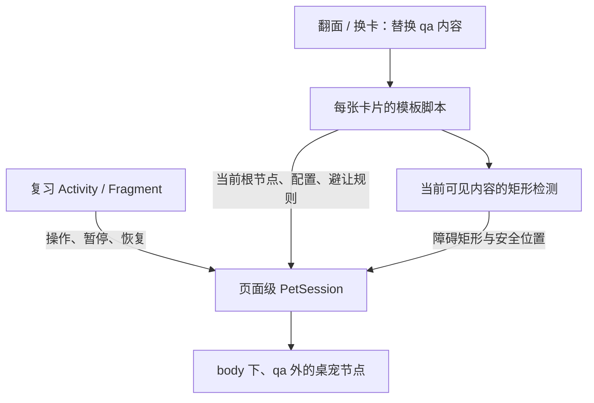

# 桌宠在复习会话中常驻：可行性与实施方案

评估日期：2026-10-08。

依据：引用对话“桌宠全局显示改动评估”、本项目源码、本地 AnkiDroid 源码及已生成的后端渲染资源。

模板项目评估版本：`070d8d4`。AnkiDroid：`0c0a878221`，2.25.1，分支 `my-change`；后端依赖为 `0.1.68-anki26.05`。AnkiDroid 工作区另有新学习屏夜间背景等本地变更。

本次是源码评估；下面的改动规模是工程估算，运行效果及设备兼容性需要在实施阶段确认。

## 结论

**可行。针对本地的新学习屏，优先把现有 JS 桌宠改为同一 WebView 内的常驻组件。** 首先用模板改动实现跨翻面、跨换卡，再用少量 AnkiDroid 宿主代码补齐整个复习界面的空闲计时和前后台通知。

这比引用对话建议的独立原生覆盖层更适合当前版本：新学习屏已经保留宿主页面，正常翻面和换卡只替换 `#qa` 内的 HTML。桌宠节点放在 `#qa` 外，状态放在页面级单例中，即可利用这个已有生命周期。

引用对话中“翻页重新加载页面”的判断适用于本地的旧学习屏。若要求同时支持旧学习屏，独立覆盖层仍是合理方案。

“全局”在本方案中指应用内的复习会话和卡片显示区域。CET、JLPT、日语语法沿用各自的避让规则；其他模板需要注册避让信息，或另行补充通用内容检测。

## 已确认的代码依据

以下路径中的 AnkiDroid 文件位于相邻仓库，链接以两个项目保持目前的目录关系为前提。

| 现象 | 实际代码与含义 |
| --- | --- |
| 新学习屏初始化加载页面 | [CardViewerFragment.kt](../../Anki-Android/AnkiDroid/src/main/java/com/ichi2/anki/previewer/CardViewerFragment.kt) 的 `setupWebView()` 调用 `loadDataWithBaseURL()`；`onWebViewRecreated()` 会重新初始化。 |
| 新学习屏翻面和换卡 | [CardViewerViewModel.kt](../../Anki-Android/AnkiDroid/src/main/java/com/ichi2/anki/previewer/CardViewerViewModel.kt) 的 `showQuestion()` / `showAnswer()` 通过 `eval` 发出 `_showQuestion(...)` / `_showAnswer(...)`。 |
| 宿主与卡片内容的分界 | [PreviewerHelpers.kt](../../Anki-Android/AnkiDroid/src/main/java/com/ichi2/anki/previewer/PreviewerHelpers.kt) 的 `stdHtml()` 创建 `
`。本机打包的 `backend/js/reviewer.js` 中，`_updateQA` 取得这个节点，替换它的 `innerHTML`，重执行其中的脚本。 |
| 现有桌宠已经在卡片节点外 | [pet.js](../src/shared/pet.js) 的 `create()` 将 `.pet` 追加到 `document.body`。正常替换 `#qa` 本身不会删除这个节点。 |
| 桌宠仍被清理的直接原因 | [runtime.js](../src/shared/runtime.js) 在卡片根节点移除或新根节点初始化时执行 `context.dispose()`；[pet.js](../src/shared/pet.js) 在这个 context 上注册了动画取消、节点删除和计时器清理。 |
| 旧学习屏确实重新加载页面 | [AbstractFlashcardViewer.kt](../../Anki-Android/AnkiDroid/src/main/java/com/ichi2/anki/AbstractFlashcardViewer.kt) 的 `loadContentIntoCard()` 在展示卡片内容时调用 `loadDataWithBaseURL()`。同一页面的 JS 单例无法跨越这种加载。 |
| 两套界面均存在 | [Reviewer.kt](../../Anki-Android/AnkiDroid/src/main/java/com/ichi2/anki/Reviewer.kt) 的 `getIntent()` 根据 `Prefs.isNewStudyScreenEnabled` 选择 `ReviewerFragment` 或旧 `Reviewer`。 |
| 可接入独立宿主脚本 | [ReviewerFragment.kt](../../Anki-Android/AnkiDroid/src/main/java/com/ichi2/anki/ui/windows/reviewer/ReviewerFragment.kt) 的 `onLoadInitialHtml()` 已通过 `extraJsAssets` 加载 `scripts/ankidroid-reviewer.js`。 |

后端实际检查文件是 `AnkiDroid/build/intermediates/assets/fullDebug/mergeFullDebugAssets/backend/js/reviewer.js`。它属于构建产物，实施应扩展模板代码或 AnkiDroid 自己的 assets。

## 现有功能可以复用多少

可复用 GIF 文件列表、随机选图、从边缘入场/路过、镜像方向、CSS 关键帧移动、点击换位，以及三套模板的障碍物选择器。[pet-config.json](../src/shared/pet-config.json) 是配置来源，[pet.css](../src/shared/pet.css) 当前以 `130px` 定义尺寸。

现有逻辑与对话描述有三处差异，实施时应明确处理：

1. `idleMs = 15000` 当前表示每个正面或背面初始化后等待 15 秒。普通点击、滚动不会重置计时，因此需要补上真正的“无操作”计时。
2. `flyChance = 0.1` 当前只在背面触发一次路过动画。建议首期保留这个触发点；若改为每次换卡也触发，需明确概率统计事件，避免重复抽取。
3. `blankSpot()` 最多随机尝试 40 个位置，失败后返回右下角。它使用选定元素的矩形避让，没有持续监听滚动，且无法保证找到空位或完全避开内容。

## 方案比较

| 方案 | 适用范围 | 估计改动规模 | 维护成本 |
| --- | --- | --- | --- |
| A：模板中的页面级 JS 单例 | 本地新学习屏，三套已适配模板 | 约 3–5 个源码文件，约 200–400 行 JS/CSS；重新生成九份模板成品 | 无 AnkiDroid 功能补丁；升级时确认宿主仍保留 `#qa` 外的页面 |
| B：A 加复习宿主通知，推荐完整方案 | 新学习屏，精确覆盖原生按钮操作与前后台 | A 的基础上约 3–4 个 AnkiDroid 文件，约 100–200 行宿主与通知代码 | 主要跟进复习页生命周期、宿主 Activity 和脚本加载接入 |
| C：独立原生桌宠层，JS 回传几何信息 | 同时支持新旧学习屏，或桌宠尺寸必须独立于页面缩放 | 约 6–10 个应用文件，加模板几何适配；通常约 500–1000 行量级，双界面和设置界面可能继续增加 | 两套复习界面、坐标转换、GIF 解码及触摸分发均需维护 |

文件数不包括文档、后续验证代码和新增设置资源；行数不包括自动生成模板的重复代码。这些范围不是已实现后的统计。

独立透明 WebView 也能支持旧学习屏并复用 GIF/CSS，但还要处理两个 WebView 的触摸路由、缩放和生命周期；在本地新学习屏上，常驻宿主页面已经提供了更直接的实现基础。

## 推荐实现：常驻状态与卡片检测分开

### 1. 页面级桌宠管理器

新增 `PetSession`，以带版本的 `window.__ankiTemplatePetSession` 单例保存当前媒体、位置、动画取消函数、驻留状态、最后操作时间和会话监听器。现有 `setupPet(context, config, obstacleSelector)` 可以保留为入口，将当前卡片注册到这个管理器。

桌宠节点和它自己的样式放在 `#qa` 外，样式使用专用类名或 ID。卡片更换仍由 `context.dispose()` 清理音频、标签和当前卡片监听器；它只解除本卡片的桌宠适配，不销毁页面级管理器。解除适配要核对卡片实例标识，防止旧卡片的延后清理影响新卡片。

由模板启动时，使用本地宿主特征识别持久页面，例如 `ankiPlatform === 'ankidroid'`、`#qa` 和 `_queueAction` 的存在，并确认复习器特征；方案 B 可在宿主脚本中提供明确的版本/能力标记。其他环境保留各自适用的生命周期，避免把仅用于当前新学习屏的假设扩散到全部客户端。

单例首次创建后，后续卡片脚本只更新适配信息。模板重复执行、背面包含 `FrontSide`、模板版本变化和当前卡片禁用桌宠都要有确定行为。跨不同笔记类型时，当前卡片的启用设置、尺寸及素材列表生效。

### 2. 保留空位检测，补齐失败与更新处理

将 `blankSpot()` 拆为收集障碍物和选择安全位置两个函数。首期继续使用三套模板现有的选择器；传递多个可见矩形及视口信息，或在同一 JS 页面内直接调用检测函数。

检测要过滤隐藏和无尺寸的元素，按实际可见区域裁剪矩形；有内部滚动容器时也考虑其裁剪范围。给障碍物增加小幅安全边距。桌宠当前矩形可用于点击换位时排除旧位置，但在判断“当前位置是否安全”时要排除它自身。

随机尝试失败后返回 `null`。可以增加有限的网格搜索降低漏判，仍找不到时暂时隐藏。视口小于桌宠尺寸时也返回无可用位置。可见状态恢复后再次检查，保留之前的素材和驻留状态。

现有算法对大块容器的判断偏保守。若实机确认长文本中可见空白较多却总找不到位置，再将文字检测细化为行框；首期不用重写全部内容检测。

落点避让可以复用现有移动方式；移动轨迹仍可能短暂经过文字。如果要求动画全程避开文字，需要额外的路径选择或换位时隐藏策略，这属于独立的行为要求。

### 3. 滚动页面的处理

桌宠采用 `position: fixed`，正常滚动时留在视口位置。滚动更新的是内容的障碍矩形。`getBoundingClientRect()` 给出相对视口的位置，并随页面及滚动容器的滚动变化，适合直接重新测量。[MDN：getBoundingClientRect](https://developer.mozilla.org/en-US/docs/Web/API/Element/getBoundingClientRect)

监听 `document` 捕获阶段的 `scroll`，覆盖卡片内部滚动；另外监听窗口 `resize`、图片 `load/error`、字体加载完成，并对当前卡片使用必要的 `ResizeObserver` / `MutationObserver`。每次卡片更换都重新绑定这些卡片观察器。

合并高频更新；建议先以约 80–120ms 的频率重新测量，再在滚动结束时补一次。当前位置仍安全就保留；与新内容重叠时立即隐藏当前可见桌宠，再选安全位置，避免持续滚动时反复启动两秒动画。滚动停止后恢复驻留，有新操作则同时重置空闲计时。

缩放、软键盘和可视窗口变化还要考虑 `visualViewport` 的宽高、偏移以及 `resize/scroll`。普通 `innerWidth/innerHeight` 在捏合缩放时可能代表布局视口，而不是实际可见区域。[MDN：VisualViewport](https://developer.mozilla.org/en-US/docs/Web/API/VisualViewport)

同一 WebView 内的显示与检测都使用 CSS 坐标，可复用当前 GIF 显示方式。桌宠会受到页面缩放的影响；如果需要固定物理尺寸，应明确增加缩放补偿，或选择方案 C。

### 4. 翻面与渲染完成

新卡片注册后，使旧几何信息失效，重新检查当前位置。当前驻留桌宠安全时保留；位置失效时换位或隐藏，保留素材和驻留状态。路过动画是否继续可由同一管理器处理，避免每张卡片再生成第二只。

新学习屏的 `onPageFinished()` 主要服务初始加载，不能把它当作每次翻面的完成事件。模板适配应在每面注册 `onShownHook`，并在实际布局稳定后测量；后端的 `_updateQA` 每次都会清空 `onUpdateHook` / `onShownHook` 数组，因此会话启动时只注册一次钩子是不够的。

字体、图片、MathJax 和背面滚动到答案区域可能继续改变布局。渲染完成后的测量要与滚动/尺寸更新共用同一入口；用卡片实例和几何版本丢弃过期的延后回调。

未适配的卡片或错误页面出现时，旧适配失效，桌宠暂时隐藏；不能继续拿上一张卡片的选择器结果做避让。支持任意模板时，再添加独立的通用检测适配器。

### 5. 真正的空闲计时与宿主接入

默认定义为：每次有效用户操作重新等待 `idleMs`；翻面、换卡和手动点击桌宠都算操作。已驻留时继续保留单只桌宠，计时用于管理以后出现机会。程序触发的滚动可以保守地作为计时重置，避免把系统调整布局误判为空闲。

方案 A 可观察页面内的指针、键盘和滚动以及卡片更新。原生顶部菜单、音频操作等事件不一定进入卡片 DOM，因此准确覆盖整个复习界面需要方案 B 的宿主通知。

建议在 `CardViewerActivity` 将用户活动转交当前 `ReviewerFragment`：使用 `onUserInteraction()` 覆盖基本操作，必要时在持续触摸分发中节流补充活动通知。Android 文档明确此回调用于用户交互，但不保证每次触摸移动都触发。[Android：Activity.onUserInteraction](https://developer.android.com/reference/android/app/Activity#onUserInteraction())

键盘事件还应在宿主 `dispatchKeyEvent()` 转交 Fragment 之前记录；本地 `SingleFragmentActivity` 会先交给 Fragment，快捷键被处理后可能跳过 Activity 默认分发，单靠 `onUserInteraction()` 不足以覆盖这些操作。

`ReviewerFragment` 在主线程通过 `SafeWebViewLayout.evaluateJavascript()` 通知常驻管理器。`onStop` 暂停计时和可见动画；`onStart` 恢复后重新测量并重新开始空闲等待。通知应合并，避免触摸移动逐次发送 JS。

宿主脚本由 `ReviewerFragment.onLoadInitialHtml()` 的 `extraJsAssets` 加载，提供能力标记和 `activity/pause/resume` 通知入口。模板依旧是配置与内容避让规则的来源。页面重建后宿主脚本及模板重新初始化；正常翻面/换卡保留状态。

同一 WebView 保存状态的边界是页面生命周期。当前清单对旋转使用 `configChanges`，常见旋转不一定重建 WebView；主题切换、渲染进程崩溃或应用进程重建仍可能丢失页面单例。首期按新会话初始化；若要求重建后恢复，再在 `SavedStateHandle` 中保存逻辑状态，不保存 DOM 节点或定时器。

### 6. 点击与原生图层

桌宠容器设置为交互目标，例如使用本地手势代码已识别的 `.tappable`，点击事件阻止继续触发卡片操作。当前新学习屏的 `isInteractable()` 会识别这个类；只阻止默认 click 不能完整覆盖其 `touchend` 手势处理。

保留桌宠之外的卡片点击、滚动和音频操作。宿主已有的标记图标、答题反馈、白板和全屏视频属于原生视图，必要时排除它们对应的区域或在这些模式下隐藏桌宠。白板开启时隐藏是首期最简单的处理。

## 建议改动清单与实施顺序

**阶段一：模板中的常驻实现。**

- 修改 `src/shared/pet.js`，或新增 `pet-session.js` 并让 `pet.js` 调用它；实现会话单例和卡片适配。
- 提取/增强空位函数、添加可见区域更新与无空位隐藏；可以放在 `pet.js` 内或独立 `pet-geometry.js`。
- 更新 `src/shared/pet.css` 的交互类、隐藏状态及尺寸处理。
- 如果增加共享文件，更新 `scripts/build.mjs` 的拼接步骤；三套 `card.js` 的调用签名可以继续沿用。
- 更新使用说明与已有清理相关断言的预期，并重新生成九份 HTML/CSS 成品。

**阶段二：补齐宿主事件，形成推荐完整方案。**

- 修改 `ReviewerFragment.kt`：加载宿主脚本、转交活动通知、处理暂停/恢复与白板等模式。
- 修改 `CardViewerActivity.kt`：观察用户交互并转交复习 Fragment；其他预览 Fragment 可不接收桌宠通知。
- 新增独立 `scripts/ankidroid-pet-host.js`；需要保持接口独立时，新增活动通知接口。
- 保留配置唯一来源 `pet-config.json`，通过模板传给管理器，宿主不另维护一份 GIF 文件列表。

**阶段三：若需要旧学习屏，增加独立覆盖层。**

复用已经拆出的几何适配器和配置，另实现跨页面加载保留的视图/控制器。应用侧只接收可见障碍矩形、候选位置、视口信息和卡片/几何版本，卡片侧负责重新测量。

选择原生图片视图时，本地最低 Android API 为 24，而平台 `ImageDecoder` 的动画解码能力从 API 28 起提供，旧设备需要兼容解码方案；因此 GIF 支持会增加工作量。[Android：ImageDecoder](https://developer.android.com/reference/android/graphics/ImageDecoder)

若使用专用 `addJavascriptInterface`，先注册再加载页面，并把回调中的视图更新切回主线程；接口只处理桌宠数据。[Android：WebView.addJavascriptInterface](https://developer.android.com/reference/android/webkit/WebView#addJavascriptInterface(java.lang.Object,%20java.lang.String))

原生坐标转换要结合 WebView 在覆盖层内的偏移、实际可见视口与缩放。不能仅用 CSS 像素乘屏幕密度。覆盖层按桌宠命中范围处理触摸，空白处不拦截卡片手势；几何消息必须丢弃过期卡片版本。支持新旧界面时分别接入对应复习宿主。

## 后续跟随官方 release

方案 A 主要维护模板对宿主 DOM 的适配，通常无需合并 AnkiDroid 功能补丁。方案 B 的应用改动可以独立成提交，新增脚本独立存放，宿主接入保持集中；原有夜间背景变更也应单独保留。

每次升级关注 `stdHtml()` 的 `#qa`、卡片替换边界、渲染完成钩子、手势交互识别、WebView 重建处理和 Activity/Fragment 生命周期。它们保留时，rebase 或 cherry-pick 的人工改动通常有限；官方重构这些位置时仍需要调整，不能保证每个 release 自动合并。

方案 C 的新增组件容易独立保存，但两套复习页接入和坐标/触摸行为有更多升级检查点。普通翻页流程继续使用官方实现，有利于控制补丁范围。

## 实施后的验收范围

| 场景 | 应达到的结果 |
| --- | --- |
| 三套模板连续翻面、换卡、切换笔记类型 | 单只驻留桌宠保留素材和会话状态，适配更新，无重复监听器或动画样式累积 |
| 背面包含 FrontSide、脚本重复执行 | 一个卡片面只注册一次，路过概率只抽取一次 |
| 点击桌宠 | 换到当前有效安全位置，卡片不跟着翻面 |
| 页面和内部容器滚动 | 桌宠屏幕位置安全时保留；内容进入其范围时隐藏/换位；无空位持续隐藏 |
| 图片/字体加载、MathJax、捏合缩放、软键盘、旋转 | 使用新几何信息，坐标一致，可见范围及尺寸正确 |
| 原生菜单、按钮、键盘操作与连续滚动 | 重置空闲计时；停止操作约 15 秒后才触发驻留 |
| 前后台切换、退出复习、WebView 重建 | 后台不继续计时出现，恢复重新检查；退出释放，页面重建按明确规则初始化 |
| 禁用配置、无适配卡片、缺失 GIF、无足够空位 | 暂时隐藏或停止创建，卡片保持可操作，无旧卡片几何残留 |
| 白板、标记图标、全屏视频、明暗主题 | 桌宠行为按排除或隐藏规则执行，相关交互正常 |

首期落点：阶段一验证本地新学习屏的页面常驻能力，阶段二补齐整个复习界面的行为要求；旧学习屏支持单独立项估算。
