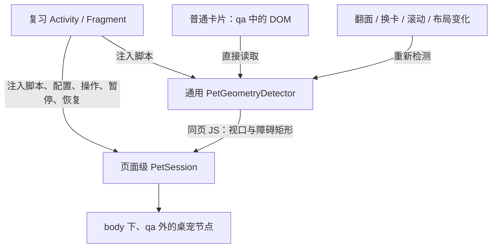

# 桌宠在复习会话中常驻：可行性与实施方案

评估日期：2026-10-08。

依据：引用对话“桌宠全局显示改动评估”、本项目源码、本地 AnkiDroid 源码及已生成的后端渲染资源。

模板项目评估版本：`070d8d4`。AnkiDroid：`0c0a878221`，2.25.1，分支 `my-change`；后端依赖为 `0.1.68-anki26.05`。AnkiDroid 工作区另有新学习屏夜间背景等本地变更。

本次是源码评估；下面的改动规模是工程估算，运行效果及设备兼容性需要在实施阶段确认。

补充评估覆盖设置菜单、新学习屏开关联动、独立媒体、几何信息协议，以及无需用户修改模板的自动注入。根据最新要求，推荐方案 B：由应用注入常驻桌宠和通用内容检测器，统一管理启用状态、素材和避让；普通模板无需加入桌宠或几何传递代码。方案 A 仅保留为不修改应用时的备选。

## 结论

**可行。针对本地的新学习屏，推荐由 AnkiDroid 注入同一 WebView 内的常驻桌宠和空位检测脚本。** 用户开启设置后，应用直接读取当前卡片 DOM、检测障碍区域并选择落点；检测结果在应用注入的 JS 模块之间传递。普通用户无需编辑模板。

这比引用对话建议的独立原生覆盖层更适合当前版本：新学习屏已经保留宿主页面，正常翻面和换卡只替换 `#qa` 内的 HTML。桌宠节点放在 `#qa` 外，状态放在页面级单例中，即可利用这个已有生命周期。

引用对话中“翻页重新加载页面”的判断适用于本地的旧学习屏。若要求同时支持旧学习屏，独立覆盖层仍是合理方案。

“全局”在本方案中指应用内的复习会话和卡片显示区域。所有模板默认使用通用检测；CET、JLPT、日语语法已有的选择器迁入应用，作为自动识别后的补充避让规则。复杂绘制内容采用保守边界，找不到安全位置时隐藏。首期范围是新学习屏。

## 已确认的代码依据

以下路径中的 AnkiDroid 文件位于相邻仓库，链接以两个项目保持目前的目录关系为前提。

| 现象 | 实际代码与含义 |
| --- | --- |
| 新学习屏初始化加载页面 | [CardViewerFragment.kt](../../Anki-Android/AnkiDroid/src/main/java/com/ichi2/anki/previewer/CardViewerFragment.kt) 的 `setupWebView()` 调用 `loadDataWithBaseURL()`；`onWebViewRecreated()` 会重新初始化。 |
| 新学习屏翻面和换卡 | [CardViewerViewModel.kt](../../Anki-Android/AnkiDroid/src/main/java/com/ichi2/anki/previewer/CardViewerViewModel.kt) 的 `showQuestion()` / `showAnswer()` 通过 `eval` 发出 `_showQuestion(...)` / `_showAnswer(...)`。 |
| 宿主与卡片内容的分界 | [PreviewerHelpers.kt](../../Anki-Android/AnkiDroid/src/main/java/com/ichi2/anki/previewer/PreviewerHelpers.kt) 的 `stdHtml()` 创建 `<div id="qa">`。本机打包的 `backend/js/reviewer.js` 中，`_updateQA` 取得这个节点，替换它的 `innerHTML`，重执行其中的脚本。 |
| 现有桌宠已经在卡片节点外 | [pet.js](../src/shared/pet.js) 的 `create()` 将 `.pet` 追加到 `document.body`。正常替换 `#qa` 本身不会删除这个节点。 |
| 桌宠仍被清理的直接原因 | [runtime.js](../src/shared/runtime.js) 在卡片根节点移除或新根节点初始化时执行 `context.dispose()`；[pet.js](../src/shared/pet.js) 在这个 context 上注册了动画取消、节点删除和计时器清理。 |
| 旧学习屏确实重新加载页面 | [AbstractFlashcardViewer.kt](../../Anki-Android/AnkiDroid/src/main/java/com/ichi2/anki/AbstractFlashcardViewer.kt) 的 `loadContentIntoCard()` 在展示卡片内容时调用 `loadDataWithBaseURL()`。同一页面的 JS 单例无法跨越这种加载。 |
| 两套界面均存在 | [Reviewer.kt](../../Anki-Android/AnkiDroid/src/main/java/com/ichi2/anki/Reviewer.kt) 的 `getIntent()` 根据 `Prefs.isNewStudyScreenEnabled` 选择 `ReviewerFragment` 或旧 `Reviewer`。 |
| 可接入独立宿主脚本 | [ReviewerFragment.kt](../../Anki-Android/AnkiDroid/src/main/java/com/ichi2/anki/ui/windows/reviewer/ReviewerFragment.kt) 的 `onLoadInitialHtml()` 已通过 `extraJsAssets` 加载 `scripts/ankidroid-reviewer.js`。 |
| 注入脚本能直接访问卡片 DOM | `stdHtml()` 先创建 `#qa`，再加载脚本；`extraJsAssets` 排在后端渲染器之后。新增应用脚本与模板处于同一页面，可观察后续替换的卡片内容。 |
| 渲染存在串行队列 | 本机打包的 `_showQuestion` / `_showAnswer` 将 `_updateQA` 排入 `_queueAction`；这两个显示函数自身没有返回渲染完成 Promise。宿主通知需要排入同一队列，不能直接 `await _showAnswer()` 后测量。 |

后端实际检查文件是 `AnkiDroid/build/intermediates/assets/fullDebug/mergeFullDebugAssets/backend/js/reviewer.js`。它属于构建产物，推荐实施只扩展 AnkiDroid 自己的 assets 和宿主接入代码。

## 现有功能可以复用多少

可复用 GIF 文件列表、随机选图、从边缘入场/路过、镜像方向、CSS 关键帧移动、点击换位，以及三套模板的障碍物选择器。[pet-config.json](../src/shared/pet-config.json) 是现有配置来源，[pet.css](../src/shared/pet.css) 当前以 `130px` 定义尺寸。推荐将这些能力迁入应用 assets，由应用配置取代模板配置；几何检测增加通用实现。

现有逻辑与对话描述有三处差异，实施时应明确处理：

1. `idleMs = 15000` 当前表示每个正面或背面初始化后等待 15 秒。普通点击、滚动不会重置计时，因此需要补上真正的“无操作”计时。
2. `flyChance = 0.1` 当前只在背面触发一次路过动画。建议首期保留这个触发点；若改为每次换卡也触发，需明确概率统计事件，避免重复抽取。
3. `blankSpot()` 最多随机尝试 40 个位置，失败后返回右下角。它使用选定元素的矩形避让，没有持续监听滚动，且无法保证找到空位或完全避开内容。

## 方案比较

| 方案 | 适用范围 | 估计改动规模 | 维护成本 |
| --- | --- | --- | --- |
| A：模板中的页面级 JS 单例 | 本地新学习屏，三套已适配模板 | 约 3–5 个源码文件，约 200–400 行 JS/CSS；重新生成九份模板成品 | 无 AnkiDroid 功能补丁；升级时确认宿主仍保留 `#qa` 外的页面 |
| B：应用注入桌宠与通用检测，推荐 | 新学习屏，普通模板默认接入；覆盖原生操作、前后台与应用开关 | 约 10–13 个应用源码/设置文件，包含两个 JS 模块；另有媒体资源与本项目旧桌宠清理。通用检测比只适配三套模板增加工作量 | 主要跟进复习页生命周期、渲染队列、设置和脚本加载；模板无需维护接口 |
| C：独立原生桌宠层，注入 JS 回传几何信息 | 同时支持新旧学习屏，或桌宠尺寸必须独立于页面缩放 | 约 6–10 个应用文件起步，另加通用检测、设置和双界面接入；原先 500–1000 行的估算不包含完整通用检测 | 两套复习界面、坐标转换、GIF 解码及触摸分发均需维护 |

方案 B 的文件数包含设置声明和显示文字资源，不含 GIF/manifest、文档和后续验证代码。行数不包括自动生成模板的重复代码。这些范围不是已实现后的统计。

独立透明 WebView 也能支持旧学习屏并复用 GIF/CSS，但还要处理两个 WebView 的触摸路由、缩放和生命周期；在本地新学习屏上，常驻宿主页面已经提供了更直接的实现基础。

## 推荐实现：应用注入桌宠与空位检测



### 1. 页面级桌宠管理器

在 `ReviewerFragment.onLoadInitialHtml()` 的 `extraJsAssets` 中加入 `scripts/ankidroid-pet-host.js` 和 `scripts/ankidroid-pet-geometry.js`。它们随宿主页面加载一次，翻面和换卡后继续运行；不把脚本内容写入笔记类型模板或卡片媒体库。

新增 `PetSession`，以带版本的 `window.AnkiPetHost` 入口保存当前媒体、位置、动画取消函数、驻留状态、最后操作时间和会话监听器。应用提供总开关、尺寸和素材列表；切换笔记类型只更新几何信息。

桌宠节点和自己的样式放在 `#qa` 外，使用专用 ID/类名，必要时隔离组件样式。模板仍可通过 `context.dispose()` 清理音频、标签和当前卡片监听器；应用桌宠不注册到这个模板 context，也不由它销毁。

宿主负责启动和停止管理器，检测模块负责当前 DOM。页面重建时重新初始化；普通翻面、背面包含 `FrontSide` 和模板脚本重复执行均不会再次创建桌宠。退出复习时释放宿主资源。

### 2. 自动检测当前卡片，模板不注册接口

`PetGeometryDetector` 直接读取 `#qa` 的可见内容，输出障碍矩形和实际可见视口。桌宠位于 `#qa` 外，自然排除自身。普通模板无需提供“空白区域传递代码”。

| 内容 | 推荐测量方式 |
| --- | --- |
| 普通文字 | 遍历非空可见文本节点，针对每个文本节点创建 `Range`，用 `getClientRects()` 取得文字片段/行框，保留段落间的空白 |
| 图片、SVG、视频、canvas、输入框、按钮及音频控件 | 将可见元素边界作为完整障碍区域；不把按钮内部留白当作落点 |
| ruby 注音、MathJax、复杂 CSS 绘制 | 增加组件规则或使用所属元素的保守边界，避免遗漏注音和装饰 |
| 跨源 iframe、无法读取内部的组件 | 将整个可见组件框作为障碍，不推断其内部空位 |

`Range.getClientRects()` 能返回选定范围占据的多个矩形；这里选择文本节点内容，而不是覆盖整个段落容器的范围，避免把容器本身的整块边界也算成文字。[MDN：Range.getClientRects](https://developer.mozilla.org/en-US/docs/Web/API/Range/getClientRects)

不能把每个 `div`、`body` 或整个 `#qa` 都作为障碍，否则全宽容器会消除本来可用的空白。过滤隐藏、透明和无尺寸内容，考虑祖先可见状态与滚动容器裁剪；给文字、图片和阴影增加安全边距。几何边界表示保守避让范围，不承诺识别图片透明像素或任意自定义绘制中的空洞。

应用可识别现有 `.cet-card`、`.jlpt-card`、`.grammar-card` 根类，将三套选择器存为内置补充规则；例如整块音频区域或词条区可按组避让。它们补充通用检测，不要求用户向模板加入新的类名或调用接口。

检测缓存文本/元素清单，DOM 变化时使缓存失效；滚动主要重新测量当前可见对象。合并相邻矩形、限制每次扫描工作量，避免长卡片导致持续强制布局。达到复杂度上限且无法确认安全位置时隐藏桌宠。首期不要求用户配置选择器，后续自定义规则可作为高级选项。

### 3. 选择安全位置与处理失败

将 `blankSpot()` 拆为独立的矩形碰撞和安全位置选择函数，复用随机取点及动画能力。桌宠当前矩形可用于点击换位时排除旧位置，但在判断“当前位置是否安全”时要排除它自身。

随机尝试失败后返回 `null`。可以增加有限的网格搜索降低漏判，仍找不到时暂时隐藏。视口小于桌宠尺寸时也返回无可用位置。可见状态恢复后再次检查，保留之前的素材和驻留状态。

落点避让可以复用现有移动方式；移动轨迹仍可能短暂经过文字。如果要求动画全程避开文字，需要额外的路径选择或换位时隐藏策略，这属于独立的行为要求。

### 4. 滚动页面的处理

桌宠采用 `position: fixed`，正常滚动时留在视口位置。滚动更新的是内容的障碍矩形。`getBoundingClientRect()` 给出相对视口的位置，并随页面及滚动容器的滚动变化，适合直接重新测量。[MDN：getBoundingClientRect](https://developer.mozilla.org/en-US/docs/Web/API/Element/getBoundingClientRect)

监听 `document` 捕获阶段的 `scroll`，覆盖卡片内部滚动；另外监听窗口 `resize`、图片 `load/error`、字体加载完成，并使用必要的 `ResizeObserver` / `MutationObserver`。`#qa` 节点在正常翻面时保留，可以持续观察它的子树；内容更换后更新元素尺寸观察对象，旧节点解除观察。[MDN：MutationObserver](https://developer.mozilla.org/en-US/docs/Web/API/MutationObserver)

合并高频更新；建议先以约 80–120ms 的频率重新测量，再在滚动结束时补一次。当前位置仍安全就保留；与新内容重叠时立即隐藏当前可见桌宠，再选安全位置，避免持续滚动时反复启动两秒动画。滚动停止后恢复驻留，有新操作则同时重置空闲计时。

缩放、软键盘和可视窗口变化还要考虑 `visualViewport` 的宽高、偏移以及 `resize/scroll`。普通 `innerWidth/innerHeight` 在捏合缩放时可能代表布局视口，而不是实际可见区域。[MDN：VisualViewport](https://developer.mozilla.org/en-US/docs/Web/API/VisualViewport)

同一 WebView 内的显示与检测都使用 CSS 坐标，可复用当前 GIF 显示方式。桌宠会受到页面缩放的影响；如果需要固定物理尺寸，应明确增加缩放补偿，或选择方案 C。

### 5. 翻面与渲染完成

宿主开始展示一个新卡片面时，使旧几何信息失效并取消依赖旧位置的延后移动，保留位置、素材和驻留状态。渲染完成后重新测量；原位置安全则保留，失效则换位或隐藏。新内容可能重叠且尚未完成测量时才暂时隐藏，不在每次翻面时重新删除和创建桌宠。路过动画也由同一管理器处理，避免每张卡片再生成第二只。

新学习屏的 `onPageFinished()` 主要服务初始加载，不能把它当作每次翻面的完成事件。后端的 `_updateQA` 每次会清空 `onUpdateHook` / `onShownHook` 数组，因此应用脚本初始化时仅注册一次 `onShownHook` 也不够。

推荐在应用自己的 `CardViewerViewModel` 卡片显示 JS 组装位置增加可选宿主通知：渲染开始通知、原有 `_showQuestion` / `_showAnswer` 调用、渲染完成通知按顺序排入 `_queueAction`。原显示调用已自行排入队列，前后通知应加入同一队列；不要将排队的显示调用再嵌套进一个等待自身后续任务的队列回调。预览页面没有桌宠入口时沿用原显示调用。

渲染完成通知安排布局测量，不等待桌宠动画或长计时器，不改变官方队列的完成条件；桌宠回调捕获自己的异常，避免异常中断后续卡片显示。`_showQuestion` / `_showAnswer` 本身返回 `undefined`，不能据此等待排版结束。应用自有脚本负责检测，不修改生成的后端 JS。

字体、图片、MathJax 和背面滚动到答案区域可能继续改变布局。渲染完成后的测量要与滚动/尺寸更新共用同一入口；用卡片实例和几何版本丢弃过期的延后回调。

模板没有专用适配器时使用通用检测；渲染失败、页面不可测量或无法找到安全位置时隐藏。旧页面的延后结果必须丢弃，不能继续拿上一张卡片的矩形做避让。

### 6. 真正的空闲计时与宿主接入

默认定义为：每次有效用户操作重新等待 `idleMs`；翻面、换卡和手动点击桌宠都算操作。已驻留时继续保留单只桌宠，计时用于管理以后出现机会。程序触发的滚动可以保守地作为计时重置，避免把系统调整布局误判为空闲。

方案 A 可观察页面内的指针、键盘和滚动以及卡片更新。原生顶部菜单、音频操作等事件不一定进入卡片 DOM，因此准确覆盖整个复习界面需要方案 B 的宿主通知。

建议在 `CardViewerActivity` 将用户活动转交当前 `ReviewerFragment`：使用 `onUserInteraction()` 覆盖基本操作，必要时在持续触摸分发中节流补充活动通知。Android 文档明确此回调用于用户交互，但不保证每次触摸移动都触发。[Android：Activity.onUserInteraction](https://developer.android.com/reference/android/app/Activity#onUserInteraction())

键盘事件还应在宿主 `dispatchKeyEvent()` 转交 Fragment 之前记录；本地 `SingleFragmentActivity` 会先交给 Fragment，快捷键被处理后可能跳过 Activity 默认分发，单靠 `onUserInteraction()` 不足以覆盖这些操作。

`ReviewerFragment` 在主线程通过 `SafeWebViewLayout.evaluateJavascript()` 通知常驻管理器。`onStop` 暂停计时和可见动画；`onStart` 恢复后重新测量并重新开始空闲等待。通知应合并，避免触摸移动逐次发送 JS。

宿主脚本由 `ReviewerFragment.onLoadInitialHtml()` 的 `extraJsAssets` 加载，提供能力标记和 `activity/pause/resume` 通知入口。应用负责总开关、素材、显示参数和内容检测；模板只负责原有卡片内容。页面重建后宿主脚本重新初始化；正常翻面/换卡保留状态。

同一 WebView 保存状态的边界是页面生命周期。当前清单对旋转使用 `configChanges`，常见旋转不一定重建 WebView；主题切换、渲染进程崩溃或应用进程重建仍可能丢失页面单例。首期按新会话初始化；若要求重建后恢复，再在 `SavedStateHandle` 中保存逻辑状态，不保存 DOM 节点或定时器。

### 7. 点击与原生图层

桌宠容器设置为交互目标，例如使用本地手势代码已识别的 `.tappable`，点击事件阻止继续触发卡片操作。当前新学习屏的 `isInteractable()` 会识别这个类；只阻止默认 click 不能完整覆盖其 `touchend` 手势处理。

保留桌宠之外的卡片点击、滚动和音频操作。宿主已有的标记图标、答题反馈、白板和全屏视频属于原生视图，必要时排除它们对应的区域或在这些模式下隐藏桌宠。白板开启时隐藏是首期最简单的处理。

## 设置菜单与新学习屏依赖

本地设置入口 [preference_headers.xml](../../Anki-Android/AnkiDroid/src/main/res/xml/preference_headers.xml) 已有独立的“新学习屏”页面，与“复习”页面并列。推荐首先在 **设置 → 新学习屏** 中增加“复习桌宠”开关，放在“屏幕”分组中；这是页面内的分组，不增加一次菜单跳转。默认关闭，说明为“复习时显示桌宠，需要启用新学习屏”。

只有一个开关时，在现有页面直接展示最简单。若下一步提供选图、导入媒体、尺寸、空闲时长和概率，则新增 **设置 → 新学习屏 → 桌宠** 子页，并将总开关和这些参数集中在子页中。子页可以在新学习屏关闭时浏览，依赖判断发生在点击启用时。

### 开关的联动方式

推荐弹窗说明依赖，提供“开启新学习屏并启用桌宠”和“取消”两个按钮。进入设置或查看桌宠参数时只展示当前状态；用户点击启用并确认后，一次完成两个开关的设置。说明文字可以写为：

> 复习桌宠需要使用新学习屏。是否同时开启新学习屏？

| 方式 | 界面行为 | 代码差异 |
| --- | --- | --- |
| 手动开启新学习屏 | 桌宠开关在依赖未满足时禁用，提示开启页面顶部的新学习屏开关；或显示说明并定位到该开关 | 可以沿用当前批量禁用逻辑，增加提示文字 |
| 点击桌宠后静默同时开启 | 直接写入两个设置，并更新界面 | 额外同步新学习屏开关及全部依赖项的状态 |
| 说明后确认，同时开启，推荐 | 用户点击启用后看见依赖说明，确认后两个开关一起开启 | 与上一项相比增加确认弹窗及取消处理 |

三种方式的渲染器实现相同。差别集中在设置监听器，通常是几十行量级的逻辑，预计不会明显改变项目总体改动规模。若要求立即把一个正在运行的旧复习 Activity 切换成新复习 Fragment，成本会明显上升；首期按设置改变后下一次进入复习选择界面处理。

本地 [ReviewerOptionsFragment.kt](../../Anki-Android/AnkiDroid/src/main/java/com/ichi2/anki/preferences/ReviewerOptionsFragment.kt) 的 `setPrefsEnableState()` 会在新学习屏关闭时禁用除主开关和帮助项以外的其他设置。采用可点击的确认方式时，要单独保留桌宠开关或桌宠入口及其所属分组的启用状态，并显示依赖说明；只放开子项而保留祖先分组禁用，仍可能无法点击。其他需要新学习屏的设置继续根据依赖单独禁用。

异步弹窗应使用可返回 `false` 的标准 `Preference.OnPreferenceChangeListener`，在确认之前拦截开关持久化。本地 [PreferenceUtils.kt](../../Anki-Android/AnkiDroid/src/main/java/com/ichi2/anki/preferences/PreferenceUtils.kt) 的便捷监听器最终固定返回 `true`，不能直接用于“弹窗之后再决定是否启用”。确认后统一写入偏好、更新两个开关的显示状态，并刷新其他依赖项；直接修改 `Prefs` 不能替代这段界面刷新。

建议用 `reviewerPetEnabled && isNewStudyScreenEnabled` 判断功能是否生效。关闭新学习屏后，保留用户的桌宠偏好并显示“启用新学习屏后恢复”，暂停实际功能；关闭桌宠不会自动关闭新学习屏。这个选择应在开关摘要中清楚显示。

本项目模板在迁移时移除旧桌宠代码，之后应用开关只控制应用注入的桌宠。已安装的旧模板仍带有独立桌宠，需要更新一次模板或停用原桌宠，避免出现两只；应用注入不能自动保证阻止任意第三方自带脚本。普通不含桌宠的模板无需修改。

如果过渡版仍保留模板桌宠作为其他客户端的兼容功能，则模板需要一次性加入宿主管理标记判断；这个标记在应用关闭桌宠时也应存在，并传递 `enabled: false`，防止回退创建旧桌宠。这属于旧实现的迁移兼容，不是普通模板必须实现的空位接口。推荐新学习屏方案不再依赖这段兼容逻辑。

新增开关预计涉及现有 `preferences_reviewer.xml`、`ReviewerOptionsFragment.kt`、`Prefs.kt`、偏好 key 资源及英文/简中显示文字资源，约 5–6 个文件；其中多个只是资源声明。加上两个注入模块、渲染通知及宿主事件后，完整方案 B 预计涉及约 10–13 个应用源码/设置文件。子页、素材导入和参数编辑属于额外范围。

## 桌宠媒体的位置

推荐按使用方式存放：

| 媒体来源 | 推荐位置 | 作用与限制 |
| --- | --- | --- |
| 随应用提供的七个 GIF | `AnkiDroid/src/main/assets/pets/aemeath/`，由 `manifest.json` 列出可用文件 | 应用安装后即可显示，与卡片内容无耦合；更新素材需要更新 APK |
| 用户自行选择的图片/动图 | 导入到当前应用 Context 的 `filesDir/reviewer-pets/<petId>/` | 应用独立管理，可更换牌组；Anki 媒体同步不包含这些文件，跨设备迁移需另做导入/导出 |
| 现有媒体库中的 GIF，作为兼容来源 | `collection.media`，沿用 `_aemeath_*.gif` | 应用可按兼容清单读取，复用现有资源处理并随 Anki 媒体同步 |

本轮只读统计本项目 `aemeath/assets` 中的七个 GIF，合计 **1,364,068 字节，约 1.30 MiB**，不是解码后的内存占用，也不是最终 APK 压缩增量。这组素材随应用内置的体积成本较小。用户自定义素材通过系统文件选择器导入应用目录，避免要求用户操作应用私有路径。[Android：应用专属文件](https://developer.android.com/training/data-storage/app-specific)

`collection.media` 可以存放不在笔记字段中引用的静态模板资源。Anki 的检查媒体功能不扫描问答模板，官方要求此类资源以 `_` 开头，以免被当作未使用媒体；现有文件已符合这个约定。[Anki：检查媒体与静态模板资源](https://docs.ankiweb.net/manual/media)

因此，媒体库可以作为既有桌宠资源的兼容来源。将桌宠作为应用设置中的独立功能时，推荐默认资源放 assets，自定义资源放应用目录；此时配置、导入和删除都能独立于牌组管理。移除模板内的桌宠后，用户不需要再把默认素材复制到媒体库。

### WebView 如何读取独立资源

默认素材可以使用 `file:///android_asset/pets/aemeath/<file>.gif`，与本地宿主脚本加载 assets 的方式一致。

应用私有目录的自定义文件建议增加限定的虚拟 GET 路径，例如 `/reviewer-pets/<petId>/<file>`，在复习 WebView 的资源拦截器中映射到该目录。复用 `ViewerResourceHandler` 或在复习子类中提供专门处理器，校验目录及文件名。现有 `ViewerResourceHandler` 只从卡片媒体目录读取文件，仍需增加这段映射。

本地 `AnkiServer` 当前对 GET 返回未找到，这个路径应由 `shouldInterceptRequest()` 提供媒体响应；不能只把 GIF 放进 `filesDir` 就期望既有服务器自动读取。

## 空位信息如何传递

### 推荐：同一 WebView 直接调用 JS 接口

应用注入的检测模块与常驻桌宠运行在同一个页面，首期不需要把空位传到 Kotlin。检测模块直接读取当前卡片 DOM，测量后调用常驻层接口，例如 `window.AnkiPetHost.updateGeometry(snapshot)`。普通用户的模板不定义或调用这个接口。

有两种数据选择：

- **可见障碍矩形 + 视口信息，首期推荐。** 注入的检测模块收集通用内容矩形，并应用内置的模板补充规则；常驻层复用随机找点函数，直接判断原位置是否仍安全。
- **已经验证过的候选位置列表。** 检测模块根据常驻层提供的实际桌宠尺寸算出多个落点，常驻层随机选取。可以同时报告当前位置是否安全，或附带障碍矩形；单独一组新候选点无法判断旧位置能否保留。

候选点比单个“整张卡片总边界框”更合适，后者不能表达分散内容之间的多个空白处。安全矩形列表也可传递，但当前脚本已有随机取点和碰撞检查，改为求出全部安全矩形通常会增加算法工作量。

下方是建议的数据对象示例，字段名属于新接口设计，当前项目尚未实现。**这段调用写在应用注入的检测模块中，不写进模板。** `candidates` 可以省略，由常驻层根据 `blockedRects` 选点：

```js
window.AnkiPetHost?.updateGeometry({
  version: 1,
  renderId: 7,
  revision: 3,
  viewport: { x: 0, y: 0, width: 375, height: 700 },
  pet: { width: 130, height: 130 },
  blockedRects: [{ x: 20, y: 60, width: 300, height: 200 }],
  candidates: [{ x: 12, y: 500 }]
})
```

`renderId` 标识当前卡片面的渲染实例，翻面或换卡都会改变；仅用 card ID 不够，因为正反面可能共用一个 ID。`revision` 标识同一面滚动、字体或图片加载后的几何更新。宿主生成/登记渲染实例，并拒绝旧实例或旧 revision。所有数字使用同一视口内的 CSS 坐标，明确矩形经过裁剪和安全边距处理；捏合缩放时需要记录实际可见视口偏移。

桌宠尺寸由常驻管理器提供给检测模块，计入实际 CSS 显示和缩放，避免检测按 `130px` 计算而宿主显示另一种尺寸。更新在每面渲染完成后进行，滚动及布局变化共用一个节流入口；桌宠点击时重新测量，不使用已经失效的点。

### 需要原生覆盖层时的回传

方案 C 才需要由应用注入的检测脚本把上述对象序列化为 JSON 并送到 Kotlin。模板仍无需写桥接代码。可以复用本地已有的 POST 路由：

```js
fetch('ankidroid/petGeometry', {
  method: 'POST',
  headers: { 'Content-Type': 'application/json' },
  body: JSON.stringify(snapshot)
})
```

当前 [ReviewerViewModel.kt](../../Anki-Android/AnkiDroid/src/main/java/com/ichi2/anki/ui/windows/reviewer/ReviewerViewModel.kt) 已处理 `focusin`、`focusout` 等 `/ankidroid/` 消息；可新增 `petGeometry` 分支，解码到独立 DTO，再发给桌宠状态流/控制器。资源路径是 GET，几何回传是 POST，两者复用不同的现有接入。

这条新增端点当前不存在，需实现后才能调用。应限制消息规模、拒绝非有限数值和过期版本，并在主线程更新视图。跨原生层还要换算 WebView 偏移及缩放；只传一个坐标对不足以支持旋转、滚动与尺寸变化。

也可以增加一个专用 `addJavascriptInterface`，但本地新学习屏的通用 `AnkiDroidJS` 接口只是警告占位，不能假定开启某个通用 API 就已有桌宠回传功能。推荐同页 JS；未来确需原生覆盖层时，再在本地 POST 接口与专用桥接中择一。

## 建议改动清单与实施顺序

**阶段一：在 AnkiDroid 中实现注入与常驻。**

- 新增 `scripts/ankidroid-pet-host.js`，迁入现有动画、点击和选图逻辑，管理页面级状态；样式使用应用专用名称。
- 新增 `scripts/ankidroid-pet-geometry.js`，实现文本行框与媒体/控件边界、裁剪、动态更新和无空位隐藏；三套模板选择器作为内置补充规则。
- 修改 `ReviewerFragment.kt`，通过 `extraJsAssets` 加载上述模块与应用配置，并接入暂停/恢复、白板等模式。
- 修改 `CardViewerViewModel.kt` 的显示 JS 组装，向现有渲染队列加入可选的开始/完成通知；保持没有桌宠入口的预览流程。
- 修改 `CardViewerActivity.kt`，观察原生用户活动并转交复习 Fragment；需要保持职责独立时新增通知接口。
- 增加 `Prefs` 总开关、设置入口及与新学习屏的确认联动；将现有七个 GIF 放入应用 assets，由 manifest 管理。

**阶段二：清理本项目模板中的旧桌宠。**

- 从三套 `src/*/card.js` 移除 `setupPet()` 调用。
- 从 `scripts/build.mjs` 移除桌宠运行代码、`petConfig` 和 `pet.css` 的拼接，不移除供音频、标签等功能使用的共享 `runtime.js`。
- 移除或归档不再使用的模板桌宠源码与配置，更新使用说明并重新生成九份 HTML/CSS 成品；不向模板加入新的检测或传递代码。
- 提供旧安装模板的一次性更新说明。模板迁移与应用功能分别提交，明确更新后的模板在其他客户端也不再包含桌宠。
- 自定义素材导入、桌宠子页和参数编辑按需要扩展，不影响普通模板的自动检测接口。

**阶段三：若需要旧学习屏，增加独立覆盖层。**

复用应用中的检测器和配置，另实现跨页面加载保留的视图/控制器。旧学习屏每次重新加载页面后重新注入检测模块；原生层接收可见障碍矩形、候选位置、视口信息和卡片/几何版本。模板无需参与。

选择原生图片视图时，本地最低 Android API 为 24，而平台 `ImageDecoder` 的动画解码能力从 API 28 起提供，旧设备需要兼容解码方案；因此 GIF 支持会增加工作量。[Android：ImageDecoder](https://developer.android.com/reference/android/graphics/ImageDecoder)

若使用专用 `addJavascriptInterface`，先注册再加载页面，并把回调中的视图更新切回主线程；接口只处理桌宠数据。[Android：WebView.addJavascriptInterface](https://developer.android.com/reference/android/webkit/WebView#addJavascriptInterface(java.lang.Object,%20java.lang.String))

原生坐标转换要结合 WebView 在覆盖层内的偏移、实际可见视口与缩放。不能仅用 CSS 像素乘屏幕密度。覆盖层按桌宠命中范围处理触摸，空白处不拦截卡片手势；几何消息必须丢弃过期卡片版本。支持新旧界面时分别接入对应复习宿主。

## 后续跟随官方 release

方案 A 主要维护模板对宿主 DOM 的适配，通常无需合并 AnkiDroid 功能补丁。推荐方案 B 的两个注入模块、设置和宿主接入可以独立成提交，检测规则随应用维护；用户模板无需跟随补丁加入调用。原有夜间背景变更也应单独保留。

每次升级关注 `stdHtml()` 的 `#qa`、卡片替换边界、渲染完成钩子、手势交互识别、WebView 重建处理和 Activity/Fragment 生命周期。它们保留时，rebase 或 cherry-pick 的人工改动通常有限；官方重构这些位置时仍需要调整，不能保证每个 release 自动合并。

方案 C 的新增组件容易独立保存，但两套复习页接入和坐标/触摸行为有更多升级检查点。普通翻页流程继续使用官方实现，有利于控制补丁范围。

## 实施后的验收范围

| 场景 | 应达到的结果 |
| --- | --- |
| 三套模板及未修改的普通模板连续翻面、换卡 | 单只驻留桌宠保留素材和会话状态，通用检测更新，无重复监听器或动画样式累积 |
| 背面包含 FrontSide、脚本重复执行 | 宿主只登记一次渲染实例，路过概率只抽取一次 |
| 点击桌宠 | 换到当前有效安全位置，卡片不跟着翻面 |
| 页面和内部容器滚动 | 桌宠屏幕位置安全时保留；内容进入其范围时隐藏/换位；无空位持续隐藏 |
| 图片/字体加载、MathJax、捏合缩放、软键盘、旋转 | 使用新几何信息，坐标一致，可见范围及尺寸正确 |
| 原生菜单、按钮、键盘操作与连续滚动 | 重置空闲计时；停止操作约 15 秒后才触发驻留 |
| 前后台切换、退出复习、WebView 重建 | 后台不继续计时出现，恢复重新检查；退出释放，页面重建按明确规则初始化 |
| 禁用配置、缺失 GIF、不可测量内容、无足够空位 | 暂时隐藏或停止创建，卡片保持可操作，无旧卡片几何残留 |
| canvas、跨源 iframe、复杂 CSS 与超长卡片 | 按保守边界避让；无法确认安全位置时隐藏，扫描和布局更新工作量受限 |
| 旧模板迁移后关闭桌宠开关 | 不再出现模板内的第二只桌宠，无需用户编写几何接口 |
| 白板、标记图标、全屏视频、明暗主题 | 桌宠行为按排除或隐藏规则执行，相关交互正常 |

首期落点：应用注入完整桌宠与通用空位检测，清理本项目模板内的旧桌宠。普通用户只需要开启设置；旧学习屏支持单独估算。本次仍是方案评估，尚未实施功能。
